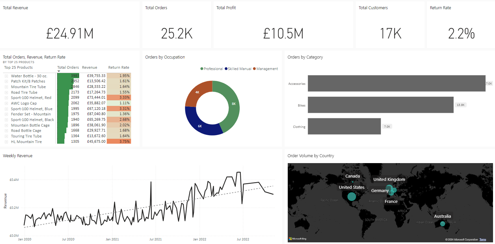

# Sales-Data-Analysis

# Power BI Project

## Overview
This project is a Power BI dashboard that analyzes overall sales revenue, orders, returns and many factors. The dashboard includes various visualizations and DAX measures to provide insights into the data.

## Files
- `PowerBI-Project.pbix`: The main Power BI Desktop file.
- `# Power BI Project

## Overview
This project is a Power BI dashboard that analyzes [describe the subject of your analysis]. The dashboard includes various visualizations and DAX measures to provide insights into the data.

## Files
- `Power BI - Sales Data Analysis`: The main Power BI Desktop file which consists of DAX Measures, Calculated Columns and various Visualizations.
- `Raw_Data`: Folder containing all the raw CSV files used in the project.
- `Power B Dashboard image`: Folder containing screenshots of the dashboard.

## Live Report
View the live report [Sales Data Analysis](https://bit.ly/4cTkjZc).

## Screenshot

## Description
[Provide a detailed description of the dashboard, the data used, and the insights derived from the analysis.]
