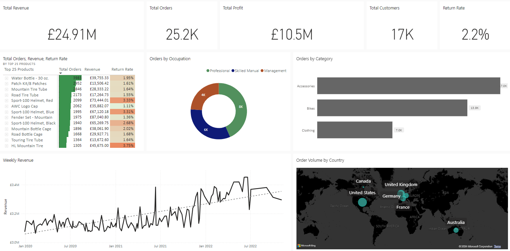

# PowerBI : Sales Dashboard with Multi Page Interactive Reports

## Overview
This project features a Power BI dashboard with interactive, multi-page reports designed to provide comprehensive insights into sales performance. The dashboard includes detailed analyses of overall sales revenue, orders, returns, and customer data. Each report page is equipped with various visualizations by incorporating multiple DAX measures to enhance data insights and facilitate deeper analysis.

## Files
- `Raw_Data`: This Folder containing all the raw CSV files used in the project.
- `Sales-Data-Dashboard-Image`: This folder contains the PowerBI Dashboard screenshot from PowerBI Service.
- `Power BI - Sales Data Analysis.pbix`: This is a main Power BI Desktop file which consists of report with multiple pages for a detailed analysis, visualizations and DAX Measures, Calculated Columns.

## Live Report
View the live report [Sales Data Analysis Report](https://app.powerbi.com/view?r=eyJrIjoiZWQ0NDAzMWItY2ZmZi00NjljLTkyMTUtYzE5YTFiZTAyYjRiIiwidCI6ImQwNzJhNDVhLWZjNzQtNDBhYy05NzY2LThlM2U4Y2I1Njg0ZiJ9&pageName=cde275c4946b428d2edd).
View the Dashboard from PowerBI Service [PowerBI Dashboard](https://app.powerbi.com/groups/a64f8d93-7f81-4d5e-a4e8-82144729e3a5/dashboards/a60b62f1-eb46-4bcd-acc9-db2cbc5c5378?ctid=d072a45a-fc74-40ac-9766-8e3e8cb5684f&experience=power-bi)

## Screenshot of the Power BI Dashboard

